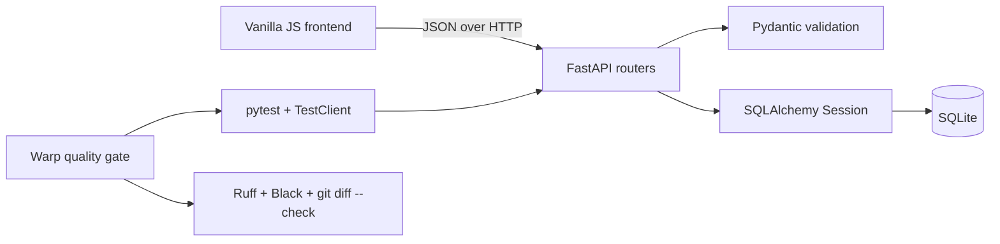

# Week 5 Implementation Guide

## Scope

The completed assignment selects two medium tasks from `docs/TASKS.md`:

1. **Task 3 - Full Notes CRUD with optimistic UI updates.**
2. **Task 4 - Action-item filters and transactional bulk completion.**

These tasks are independent at the API level and therefore suit concurrent Agents, while their shared frontend makes integration risk visible and worth discussing.

## Architecture



`backend/app/routers/notes.py` owns note reads and mutations. `backend/app/routers/action_items.py` owns item creation, filtering, completion, and bulk completion. `backend/app/schemas.py` defines validation and response contracts. The dependency-free UI in `frontend/` calls those APIs through a shared `fetchJSON` helper.

## Behavioral contracts

### Notes

- `PUT /notes/{id}` replaces the title and content of an existing note.
- `DELETE /notes/{id}` removes an existing note.
- Invalid title/content payloads return FastAPI's `422` validation response.
- Missing IDs return `404` and do not change the UI.
- The browser updates immediately, then restores the previous state if the request fails.

### Action items

- `GET /action-items/?completed=true|false` filters by completion state; omitting the query returns all items.
- `POST /action-items/bulk-complete` validates a non-empty unique ID list.
- All IDs are checked before any row is changed. A missing ID returns `404`, preserving the transaction's prior state.
- The browser supports All/Open/Completed filters, selection, and bulk completion.

## Verification

Run the reusable gate from `week5/`:

```bash
bash scripts/quality_gate.sh backend/tests
```

For a manual demo, run Uvicorn and visit the UI plus OpenAPI docs:

```bash
PYTHONPATH=. /root/miniconda3/envs/cs146s/bin/python -m uvicorn \
  backend.app.main:app --host 127.0.0.1 --port 8000
```

With an SSH tunnel (`ssh -L 8000:127.0.0.1:8000 root@190.92.200.190`), open `http://localhost:8000` and `http://localhost:8000/docs` locally.
