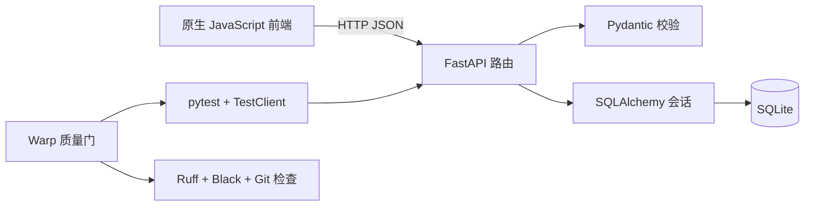

# Week 5 实现说明

## 实现范围

本作业完成了两个中等难度任务：

1. **任务 3：完整 Notes CRUD 与乐观 UI。**
2. **任务 4：Action Items 筛选与事务性批量完成。**

两项任务的 API 路由相互独立，适合并行开发；共享前端带来的集成风险则用于验证 worktree 和人工监督流程。

## 系统架构



- `backend/app/routers/notes.py`：Note 查询、更新和删除。
- `backend/app/routers/action_items.py`：Action Item 创建、筛选、完成和批量完成。
- `backend/app/schemas.py`：请求校验与响应合约。
- `frontend/`：通过统一的 `fetchJSON` 辅助函数调用 API。
- `backend/tests/`：使用独立临时数据库验证接口行为。

## Notes 行为合约

- `PUT /notes/{id}` 更新已有 Note 的标题和内容。
- `DELETE /notes/{id}` 删除已有 Note。
- 无效标题或内容返回 FastAPI `422` 校验响应。
- 不存在的 ID 返回 `404`，不会改变服务器数据。
- 浏览器先更新界面；请求失败时恢复原值并显示错误。

## Action Items 行为合约

- `GET /action-items/?completed=true|false` 按完成状态筛选；省略参数时返回全部记录。
- `POST /action-items/bulk-complete` 要求 ID 列表非空且不重复。
- 修改数据前先确认全部 ID 存在；缺失 ID 返回 `404`，事务保持原状态。
- 浏览器支持 All、Open、Completed 筛选，以及多选和批量完成。

## 验证方式

从 `week5/` 运行统一质量门：

```bash
bash scripts/quality_gate.sh backend/tests
```

启动应用：

```bash
PYTHONPATH=. /root/miniconda3/envs/cs146s/bin/python -m uvicorn \
  backend.app.main:app --host 127.0.0.1 --port 8000
```

建立 SSH tunnel 后，可在本地访问 `http://localhost:8000` 和 `http://localhost:8000/docs`。
