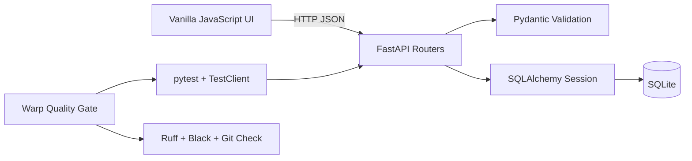

# Week 5 展示汇报：用 Warp 组织可监督的多 Agent 开发

## 1. 汇报目标

本次汇报建议控制在 **12–15 分钟**。核心不是展示“AI 写了多少代码”，而是说明如何把一个开发任务组织成：

> **规则约束 → Worktree 隔离 → 并发实现 → 人工集成 → 自动质量门**

本作业完成了两个中等难度任务：

- **Task 3：完整 Notes CRUD**——更新、删除、Pydantic 校验，以及带失败回滚的乐观 UI。
- **Task 4：Action Items 筛选与批量完成**——按完成状态筛选、事务性批量更新及批量操作 UI。

最终结果：**20 个测试通过，Ruff、Black 和 `git diff --check` 全部通过。**

## 2. 汇报时间安排

| 时间 | 内容 | 对应材料 |
| --- | --- | --- |
| 0:00–1:00 | 作业目标与选题 | `assignment.md`、`docs/TASKS.md` |
| 1:00–2:30 | 项目架构与初始状态 | `docs/IMPLEMENTATION.md` |
| 2:30–4:30 | Automation A：规则与质量门 | `AGENTS.md`、`.warp/workflows/`、`scripts/quality_gate.sh` |
| 4:30–7:30 | Automation B：多 Agent 与 worktree | `docs/WARP_MULTI_AGENT_PLAYBOOK.md`、Git 提交图 |
| 7:30–9:00 | 合并冲突与人工监督 | `writeup_zh.md` 的 Automation B.d |
| 9:00–12:00 | Web UI 与 API 演示 | 首页、`/docs` |
| 12:00–13:30 | 最终质量门 | `bash scripts/quality_gate.sh backend/tests` |
| 13:30–15:00 | 反思与问答 | 本文“总结与问答” |

## 3. 开场讲稿

> Week 5 的主题是现代终端与 Agentic Development。作业不只要求实现功能，还要求把 Warp Drive 自动化和多 Agent 工作流用于真实项目。我选择了两个 medium 任务：Notes 完整 CRUD，以及 Action Items 筛选和事务性批量完成。
>
> 我的设计重点不是让一个 Agent 包办所有工作，而是给不同 Agent 明确的任务所有权，用 Git worktree 隔离文件状态，再通过统一质量门和人工 diff review 完成结果收敛。

## 4. 项目架构



讲解：

> 前端没有 Node 构建链，直接由 FastAPI 提供静态文件。后端使用 Pydantic 定义输入边界，SQLAlchemy 管理 SQLite 事务，pytest 通过独立临时数据库验证接口。Warp Workflow 不替代测试，而是提供统一、可重复的测试入口。

## 5. Automation A：Project Rule 与质量门

### 5.1 展示文件

依次打开：

1. `AGENTS.md`
2. `.warp/workflows/week5-quality-gate.yaml`
3. `scripts/quality_gate.sh`
4. `docs/warp/QUALITY_GATE_PROMPT.md`

### 5.2 讲稿

> `AGENTS.md` 相当于项目级开发规范。它要求 Agent 只能修改 `week5/`，新增行为必须有测试，并发任务必须使用分支或 worktree，而且 Agent 不能自行 merge 或 push。
>
> YAML Workflow 提供 Warp 中可搜索、可参数化的入口；真正的验证逻辑位于 Shell 脚本中，因此同一自动化也能用于 SSH 或 CI。质量门按照 pytest、Ruff、Black、Git whitespace 的顺序执行，任何一步失败都会立即停止。

质量门命令：

```bash
cd /root/modern-software-dev-assignments/week5
bash scripts/quality_gate.sh backend/tests
```

### 5.3 Before vs. After

- **Before：**人工记住并逐条运行四个检查，容易漏项。
- **After：**一个入口执行相同验证标准，支持完整测试套件或单个 pytest selector。
- **真实收益：**20 个功能测试都通过时，Ruff 仍捕获了 import 排序问题，证明“测试通过”不等于“工程质量门通过”。

## 6. Automation B：多 Agent 与 Git worktree

### 6.1 角色划分

| 角色 | 分支 | Worktree | 结果 |
| --- | --- | --- | --- |
| Notes Agent | `week5-task3` | `/root/worktrees/week5-task3` | `59c3a4c`，隔离测试 15 passed |
| Action Agent | `week5-task4` | `/root/worktrees/week5-task4` | `afd9a76`，隔离测试 8 passed |
| Supervisor | `xyp` | `/root/modern-software-dev-assignments` | 解决冲突，最终 20 passed |

现场运行：

```bash
git -C /root/modern-software-dev-assignments worktree list
git -C /root/modern-software-dev-assignments \
  log --graph --oneline --decorate -12
```

### 6.2 讲稿

> 两个任务的 API 相互独立，但都会修改 `schemas.py` 和前端文件。如果只开两个普通终端，它们会共享同一文件状态，存在互相覆盖的风险。Worktree 为每个 Agent 提供独立目录和分支，让并发修改先变成两个聚焦的提交，再由监督者显式合并。
>
> 第一次合并 Action Items 时没有冲突；第二次合并 Notes 时，`backend/app/schemas.py` 和 `frontend/styles.css` 发生冲突。我没有简单选择某一边，而是保留两套 Pydantic 模型和两组 CSS 规则，再重新运行完整质量门。

### 6.3 自主程度

- Agent 可以读取和修改自己 worktree 中的 `week5/` 文件。
- Agent 可以运行测试、lint、format 和创建自己的 feature commit。
- Agent 不允许删除文件、修改 writeup、合并其他分支或推送。
- Supervisor 负责 diff review、冲突处理、最终测试和 push。

## 7. 功能演示

### 7.1 启动服务

本地建立 SSH tunnel：

```bash
ssh -L 8000:127.0.0.1:8000 root@190.92.200.190
```

在远程服务器运行：

```bash
cd /root/modern-software-dev-assignments/week5
PYTHONPATH=. /root/miniconda3/envs/cs146s/bin/python -m uvicorn \
  backend.app.main:app --host 127.0.0.1 --port 8000
```

浏览器打开：

- `http://localhost:8000`
- `http://localhost:8000/docs`

### 7.2 Notes 演示顺序

1. 创建一条 Note。
2. 点击 Edit，修改标题和内容。
3. 解释乐观更新：UI 先变化，接口失败时恢复原值并显示错误。
4. 点击 Delete，说明删除失败时列表同样会回滚。
5. 在 Swagger 中提交空标题，展示 `422` 校验错误。

### 7.3 Action Items 演示顺序

1. 创建三个 Action Item。
2. 单独完成其中一个。
3. 切换 All、Open、Completed。
4. 勾选两个未完成项并批量完成。
5. 在 Swagger 中调用 `/action-items/bulk-complete`，传入一个有效 ID 和一个不存在的 ID。
6. 再次 GET 列表，说明有效 ID 没有被部分更新，证明事务回滚有效。

## 8. 最终验证

```bash
cd /root/modern-software-dev-assignments/week5
bash scripts/quality_gate.sh backend/tests
```

展示以下结果：

```text
.................... [100%]
20 passed
All checks passed!
Quality gate passed.
```

补充说明：

- `/`、`/openapi.json`、`/notes/` 和带筛选参数的 `/action-items/` smoke test 均返回 HTTP 200。
- 合法请求体更新不存在的 Note 返回 HTTP 404。
- 最终前端 JavaScript 通过语法检查。

## 9. 限制与诚实说明

本地 Warp 已安装，但账户没有可用的付费 Agent 额度，因此没有生成公开的 Warp Agent Session URL。汇报中不要虚构链接或声称存在未执行的 Warp Agent 会话。

可展示的真实、可复现证据包括：

- 两个 Warp YAML Workflow 定义。
- `AGENTS.md` Project Rule。
- 两个独立 worktree 和 feature commit。
- 真实 merge commit 与冲突记录。
- 20-test 最终质量门。
- `docs/WARP_MULTI_AGENT_PLAYBOOK.md` 中保存的完整任务 Prompt。

## 10. 总结讲稿

> 这次实验表明，多 Agent 的价值不仅是速度，更重要的是任务所有权和失败隔离。Worktree 解决并发文件覆盖，测试验证业务语义，质量门统一完成标准，而最终的 diff review 和冲突处理仍由人负责。
>
> Agent 可以自动执行工程步骤，但“什么结果可以被接受”必须由可重复的验证和人工判断共同决定。这也是我认为现代终端最重要的变化：开发者从逐行输入命令，转向设计上下文、权限、任务边界和反馈循环。

## 11. 常见问答

### 为什么不用一个 Agent 完成全部任务？

两个任务具有独立 API 边界，适合并行。分开上下文可减少提示污染，也让每个提交更容易审查。

### 为什么普通的两个终端不够？

普通终端共享同一 checkout。两个 Agent 同时修改前端文件时可能互相覆盖；worktree 同时隔离目录和分支。

### 并发是否一定更快？

独立实现阶段更快，但集成仍有成本。本次真实冲突说明，并行减少等待时间，却不能消除协调和 review。

### 为什么需要四层质量门？

pytest 验证行为，Ruff 检查静态问题，Black 检查格式，`git diff --check` 捕获空白错误。任何一层都不能完全替代其他层。

### 最大风险是什么？

两个 Agent 同时修改 `frontend/app.js`、`index.html`、`styles.css` 和 `schemas.py`。解决方案是独立 worktree、聚焦提交、按顺序合并、人工冲突处理和完整回归测试。

### 没有 Warp Agent 额度是否影响展示？

不能展示真实的付费 Warp Agent Session，但可以如实展示 Warp Workflow 定义、Project Rule、多 worktree 工作流、提交历史和现场质量门，并明确说明额度限制。

## 12. 汇报材料清单

- 本文：`docs/WEEK5_PRESENTATION.md`
- 中文提交报告：`writeup_zh.md`
- 英文提交报告：`writeup.md`
- 架构与 API：`docs/IMPLEMENTATION.md`
- 多 Agent Prompt 和复现步骤：`docs/WARP_MULTI_AGENT_PLAYBOOK.md`
- 逐分钟操作手册：`docs/REPORT_RUNBOOK.md`
- 详细讲稿和问答：`docs/LAB_PRESENTATION_GUIDE.md`
- 证据索引：`docs/warp/EVIDENCE.md`
- 理论背景笔记：仓库根目录的 `week5.md`

## 13. 汇报前检查

- [ ] SSH tunnel 可以访问 `localhost:8000`。
- [ ] Web UI 和 `/docs` 已提前打开。
- [ ] `git worktree list` 和 Git 提交图能够正常显示。
- [ ] 最终质量门已预运行一次。
- [ ] 演示数据库中准备了 2–3 条测试数据。
- [ ] 已准备质量门输出截图，以防现场网络异常。
- [ ] 不展示密码、令牌、私有邮箱或其他敏感信息。
