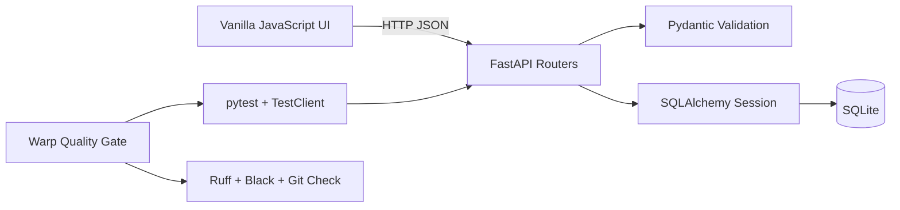

# Week 5：用 Warp 组织可监督的多 Agent 开发

## 项目目标

Week 5 的核心任务，是把 AI 辅助开发组织成可约束、可并行、可验证、可复现的工程流程：

> **规则约束 → Worktree 隔离 → 并发实现 → 人工集成 → 自动质量门**

本项目在 FastAPI、SQLAlchemy、SQLite 和原生 JavaScript 构成的应用中完成了两个中等难度任务：

- **Task 3：完整 Notes CRUD**——支持更新、删除、Pydantic 校验和失败回滚的乐观 UI。
- **Task 4：Action Items 筛选与批量完成**——支持状态筛选、事务性批量更新和批量操作 UI。

最终结果：**20 个测试通过，Ruff、Black 和 Git whitespace 检查全部通过。**

## 系统架构



- 前端无需 Node 构建链，由 FastAPI 直接提供静态资源。
- Pydantic 定义输入边界，SQLAlchemy 管理数据库会话与事务。
- pytest 使用独立临时数据库验证 API 行为。
- Warp Workflow 为测试和静态检查提供统一、可重复的入口。

## Automation A：Project Rule 与质量门

### Project Rule

`AGENTS.md` 为所有 Agent 提供相同的工程约束：

- 修改范围限制在 `week5/`。
- 新增行为必须有对应测试。
- 并发任务使用独立分支或 worktree。
- Agent 可以检查、实现和验证，但不能自行合并或推送。
- 最终集成由监督者审查 diff 后完成。

### Warp Quality Gate

`.warp/workflows/week5-quality-gate.yaml` 提供 Warp 中可搜索、可参数化的入口，`scripts/quality_gate.sh` 承载可在 Warp、SSH 或 CI 中复用的验证逻辑：

```bash
cd /root/modern-software-dev-assignments/week5
bash scripts/quality_gate.sh backend/tests
```

质量门依次执行：

1. pytest 功能测试；
2. Ruff 静态检查；
3. Black 格式检查；
4. `git diff --check` 空白检查。

任何一步失败都会立即停止。与手工逐条运行相比，统一入口减少了漏检和环境不一致。

## Automation B：多 Agent 与 Git worktree

| 角色 | 分支 | Worktree | 可审计结果 |
| --- | --- | --- | --- |
| Notes 工作单元 | `week5-task3` | `/root/worktrees/week5-task3` | `59c3a4c`，隔离测试 15 passed |
| Action Items 工作单元 | `week5-task4` | `/root/worktrees/week5-task4` | `afd9a76`，隔离测试 8 passed |
| Supervisor | `xyp` | `/root/modern-software-dev-assignments` | 冲突处理与最终 20 passed |

Worktree 同时隔离分支和文件状态。两个任务可以独立修改代码并形成聚焦提交，不会在共享 checkout 中互相覆盖。

```bash
git -C /root/modern-software-dev-assignments worktree list
git -C /root/modern-software-dev-assignments \
  log --graph --oneline --decorate -12
```

### 权限边界

- 每个工作单元可以读取、修改和测试自己的 `week5/` worktree。
- 每个工作单元可以创建自己的 feature commit。
- 文件删除、跨分支合并和远程 push 不属于工作单元权限。
- Supervisor 负责 diff review、冲突解决、完整回归测试和最终 push。

## Notes CRUD

### API 合约

- `PUT /notes/{id}` 更新标题和内容。
- `DELETE /notes/{id}` 删除 Note。
- 空标题、超长标题或超长内容返回 `422`。
- 不存在的 ID 返回 `404`。

### 乐观 UI

编辑或删除时，浏览器先更新本地界面，再发送请求。如果请求失败，界面恢复原数据并显示错误。这样既保留即时反馈，也避免客户端状态与服务器永久不一致。

## Action Items 筛选与批量完成

### API 合约

- `GET /action-items/?completed=true|false` 按完成状态筛选。
- 不提供 `completed` 参数时返回全部记录。
- `POST /action-items/bulk-complete` 接收非空、去重后的 ID 列表。
- 任意 ID 不存在时返回 `404`，所有记录保持原状。

### 事务语义

批量接口先检查全部 ID，再执行更新。输入中即使只有一个无效 ID，也不会产生“部分成功”的数据库状态。

前端支持 All、Open、Completed 三种视图，以及多选和批量完成。

## 集成结果

两个任务在 API 层面相互独立，但共同修改 schema 和前端资源：

- Action Items 分支首先完成合并。
- Notes 分支随后在 `backend/app/schemas.py` 和 `frontend/styles.css` 产生真实冲突。
- 集成保留了两套 Pydantic 模型和两组 CSS 规则。
- `frontend/app.js` 和 `frontend/index.html` 由 Git 自动合并。

Worktree 消除了并发覆盖，但共享设计表面仍需要人工判断。冲突是显式、可审查的集成事件，而不是隐藏的文件竞争。

## 验证结果

```text
.................... [100%]
20 passed
All checks passed!
Quality gate passed.
```

- `/`、`/openapi.json`、`/notes/` 和带筛选参数的 `/action-items/` 均通过 HTTP 200 smoke test。
- 合法请求体更新不存在的 Note 返回 HTTP 404。
- Notes 校验、事务回滚、筛选和批量完成均有自动测试覆盖。
- 最终前端 JavaScript 通过语法检查。
- 质量门曾在测试通过后发现 import 排序问题，说明功能测试不能替代静态检查。

## 可复现入口

启动服务：

```bash
cd /root/modern-software-dev-assignments/week5
PYTHONPATH=. /root/miniconda3/envs/cs146s/bin/python -m uvicorn \
  backend.app.main:app --host 127.0.0.1 --port 8000
```

通过 SSH tunnel 访问：

```bash
ssh -L 8000:127.0.0.1:8000 root@190.92.200.190
```

- Web UI：`http://localhost:8000`
- OpenAPI：`http://localhost:8000/docs`

## 证据与限制

仓库中可复现的证据包括：

- `AGENTS.md` 英文 Rule 原件及 `docs/AGENT_RULES_ZH.md` 中文摘要；
- 两个 Warp YAML Workflow；
- 两个独立 worktree 与 feature commit；
- 合并记录和真实冲突文件；
- 20-test 最终质量门；
- `docs/WARP_MULTI_AGENT_PLAYBOOK_ZH.md` 中的中文任务合约。

本地 Warp 已安装，但账户没有可用的付费 Agent 额度，因此没有生成公开的 Warp Agent Session URL，也没有把普通 shell 或其他工具的执行记录表述为 Warp Agent Session。

## 工程结论

1. 多 Agent 的主要价值不仅是速度，还包括任务所有权和失败隔离。
2. Worktree 解决并发文件覆盖，但不能消除共享文件上的集成成本。
3. 测试验证业务语义，静态检查和格式检查补充工程质量。
4. Agent 可以执行步骤，但完成标准、权限边界和最终接受仍由人负责。
5. 现代终端的关键变化，是开发者开始设计上下文、权限、任务边界和反馈循环。

## 相关文档

- `docs/TASKS_ZH.md`：中文任务范围与选题理由
- `docs/IMPLEMENTATION_ZH.md`：中文架构与 API 合约
- `docs/AGENT_RULES_ZH.md`：中文 Agent 项目规则
- `docs/WARP_MULTI_AGENT_PLAYBOOK_ZH.md`：中文并行工作流与任务 Prompt
- `docs/warp/EVIDENCE_ZH.md`：中文证据索引
- `writeup_zh.md`：中文完整报告
